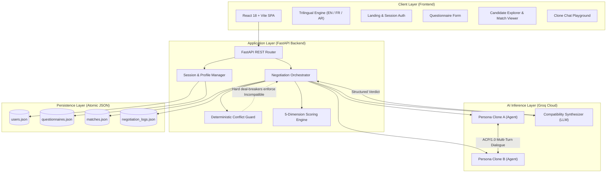
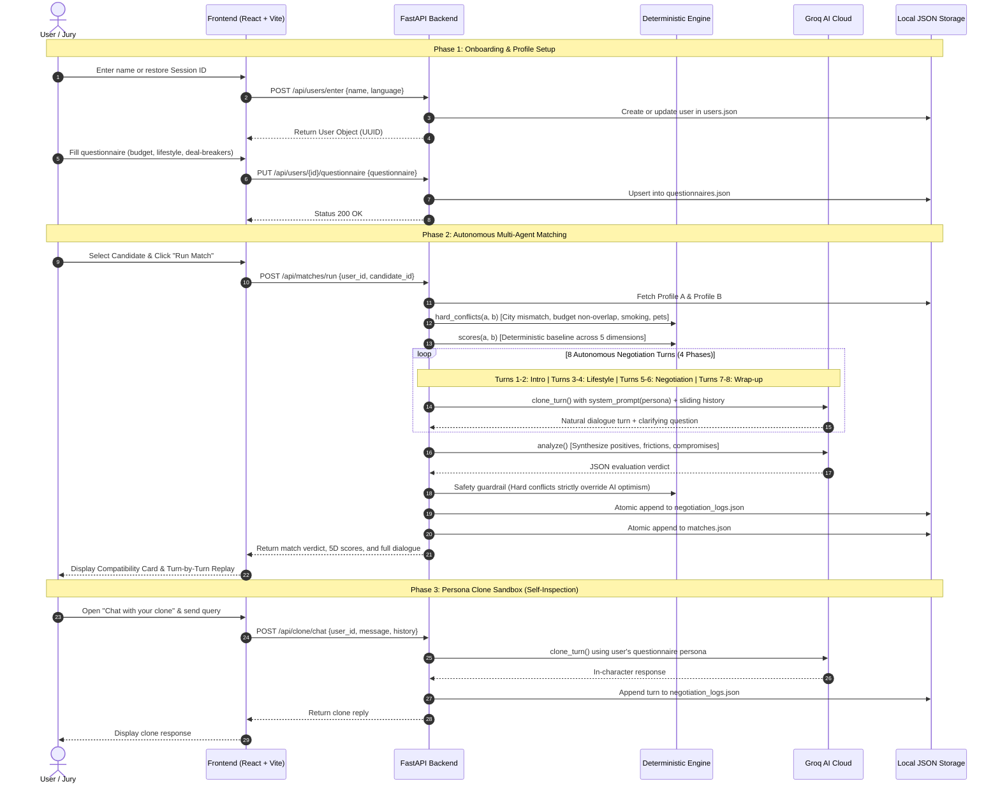

# Binomi

AI-powered roommate compatibility matching for Tunisia.

## What Binomi does

1. Enter a name — no account, password, OAuth, or login.
2. Complete a profile covering location, TND budget, routines, lifestyle, hobbies, priorities, and deal-breakers.
3. Browse other completed profiles.
4. Run an AI match: two profile-specific clones hold an ACP/1.0-style conversation.
5. Receive Strong, Conditional, or Incompatible results with dimension scores and explanations.
6. Open the complete saved clone negotiation later.
7. Chat with your own clone to verify how your profile is represented.

---

## System Architecture & Jury Call Flow

### 1. High-Level Architecture

---

### 2. End-to-End Call Flow (Jury Sequence)

The diagram below maps every call from user onboarding, autonomous 8-turn agent negotiation, and evaluation synthesis, to self-verification:

---

### 3. API Call Reference for the Jury

| Endpoint | Method | Trigger / Purpose | Processing Logic | Deterministic vs AI |
| :--- | :--- | :--- | :--- | :--- |
| `/api/users/enter` | `POST` | Onboarding / Login | Creates new UUID or resumes existing session ID. | **Deterministic** |
| `/api/questionnaire/schema` | `GET` | Form Builder | Delivers localized form schema (Tunisian cities, TND brackets). | **Deterministic** |
| `/api/users/{id}/questionnaire` | `PUT` | Save Profile | Validates & persists housing/lifestyle preferences. | **Deterministic** |
| `/api/candidates/{id}` | `GET` | Discovery Screen | Filters candidates who have completed questionnaires. | **Deterministic** |
| `/api/matches/run` | `POST` | **Core Matching Pipeline** | 1. Checks hard deal-breakers. 2. Computes baseline scores. 3. Runs 8-turn ACP/1.0 clone dialogue. 4. Generates synthesized verdict. | **Hybrid**: Deterministic guardrails enforce non-negotiables; Groq LLM powers dialogues & synthesis. |
| `/api/matches/{id}` | `GET` | Match History | Retrieves historical verdicts, dimension scores, and partner profiles. | **Deterministic** |
| `/api/negotiations/{log_id}` | `GET` | Audit / Replay | Delivers the complete turn-by-turn negotiation transcript. | **Deterministic** |
| `/api/clone/chat` | `POST` | Persona Sandbox | Allows the user to interrogate their own clone to verify how they are represented. | **AI**: Single-persona Groq prompt with conversation memory. |

---

## Run locally

### Backend:
- Create a Python virtual environment.
- Install requirements with: `pip install -r requirements.txt`
- Copy `.env.example` to `.env` and set `GROQ_API_KEY` for live AI.
- Start with: `python -m backend.server`

### Frontend:
- `cd frontend`
- `npm install`
- `npm run dev`

The frontend defaults to `http://localhost:8000` for the API. Set `VITE_API_URL` if needed.

Without a Groq key, the prototype uses deterministic fallback clone responses and scoring so the full flow remains demonstrable.

---

## AI Contribution & Compatibility Intelligence

AI represents each participant through a profile-specific clone, conducts multi-turn compatibility conversations, and summarizes shared ground, friction points, and compromises.

- **Early Deal-Breaker Detection**: Evaluates critical deal-breakers within the first three turns of negotiation.
- **Five-Dimension Verdict**: Analyzes compatibility across living habits, rhythm, financial expectations, social boundaries, and communication style.
- **Deterministic Guardrails**: Hard deal-breakers (budget ceilings, non-negotiable locations, smoking/pet constraints) are guarded deterministically — the AI cannot override an explicit hard conflict.
- **Trilingual Support**: English, French, and Arabic are supported, with Tunisian locations and TND budgets.

---

## Hackathon & Sponsor Award Alignment

### SupplyzPro Award Assessment

| Criteria | Analysis & Evidence |
| :--- | :--- |
| **Track & Focus** | **SupplyzPro Award** (*Find the Hidden Failures*) |
| **Why the project fits** | The project does not currently demonstrate the "Find the Hidden Failures" use case required by SupplyzPro. Its AI agents are designed for roommate compatibility: they surface deal-breakers, negotiate preferences, and produce a five-dimension compatibility verdict, rather than detecting, grouping, and prioritizing operational failures. |
| **Concrete evidence** | The project documentation shows early deal-breaker detection within the first three turns and structured AI negotiation, but it does not provide evidence of failure detection, failure grouping, or evidence-based prioritization. |
| **Where to see it** | Project PDF, pages 3–4, sections "User value" and "Differentiation"; backend negotiation logic (`backend/server.py`) and logs (`data/negotiation_logs.json`). |
| **Country / Eligibility fit** | Not confirmed from the provided materials — do not claim eligibility. |

> **Important Assessment Note:** A stronger SupplyzPro claim should not be submitted unless a repository or video demonstration explicitly showcases failure detection, grouping, and operational prioritization. The materials reliably validate the roommate-matching and deal-breaker negotiation claims.
